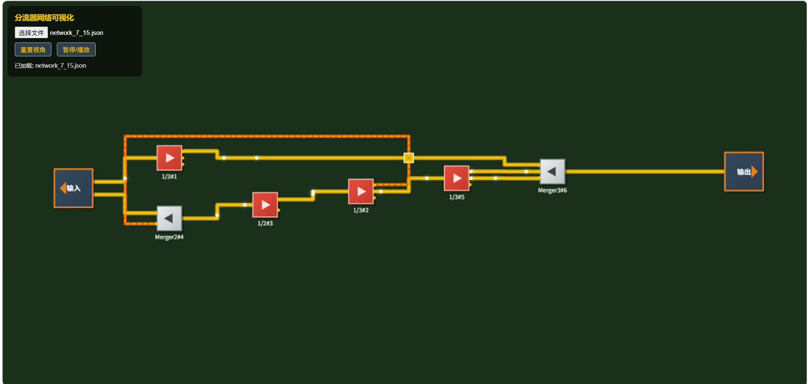
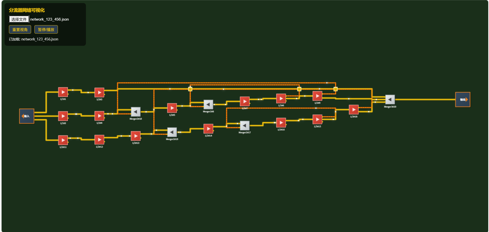
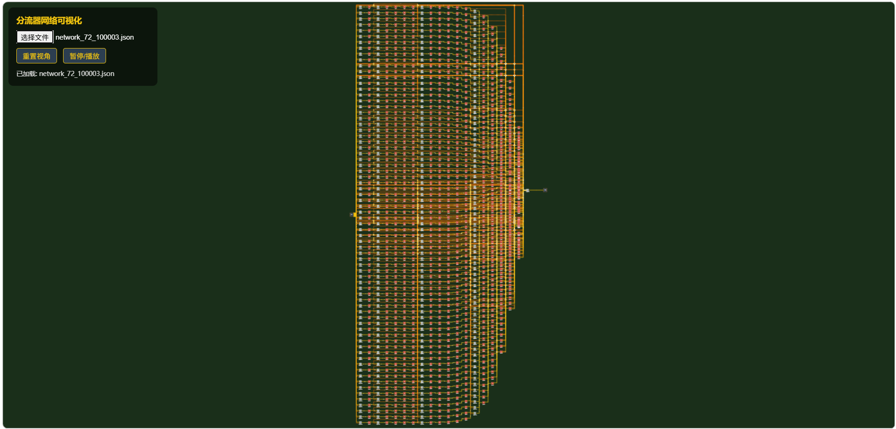

# 终末地有理数构造器

> **仅用 1/2、1/3 两种分流器 + 集流器，构造任意正有理数分流网络。**

给定任意有理数 $\frac{n}{m}$，自动构造由 1/2、1/3 分流器和集流器组成的物流网络，其稳态输出恰好等于 $\frac{n}{m}$。完整数学证明及优化算法见 [prove.md](prove.md)。


---

## 数学核心：为什么可行？

### 基本运算规则

分流器网络遵循两种基本组合（对应电路串并联）：

| 运算       | 规则                           | 效果          |
| ---------- | ------------------------------ | ------------- |
| **串联**   | 分流系数 $a$ 串联 $b$          | 总系数 $a \cdot b$ |
| **并联**   | 分流系数 $a$ 并联 $b$，输出汇流 | 总系数 $a + b$    |

已知基底：$\frac12$、$\frac13$。目标：构造任意正有理数 $\frac{n}{m}$。

### 核心思路

只需构造所有**单位分数** $\frac1m$（$m$ 为任意正整数），再将 $n$ 个 $\frac1m$ 并联相加即得 $\frac{n}{m}$。

**引理 1（反馈回路）**：若 $\frac1k$ 可构造，则 $\frac1{k-1}$ 也可构造。

**引理 2（质数递推）**：对任意奇质数 $p$：

$$\frac1p = \frac{2}{p+1} = \frac{1}{t} \cdot \frac12,\quad t = \frac{p+1}{2} < p$$

由数学归纳法，所有质数倒数均可由更小分母递推构造。

**引理 3（合数分解）**：合数 $m = \prod p_i^{a_i}$，则 $\frac1m = \prod \big(\frac1{p_i}\big)^{a_i}$（串联）。

### 结论

> **仅使用 $\frac12$、$\frac13$ 分流器的串联、并联、反馈组合，可构造任意正有理数。**

<details>
<summary>📐 点击展开：十万级质数 $p=100003$ 构造演示</summary>

$$\frac1{100003} = \frac{2}{100004} = \frac{1}{50002} \cdot \frac12$$

$$50002 = 2 \times 23 \times 1087$$

逐层分解质因数，最终全部归约为 $\frac12$、$\frac13$ 的嵌套串联与反馈。构造出 $\frac1{100003}$ 后，并联 72 路即得 $\frac{72}{100003}$。

</details>

---

## 项目结构

| 文件                    | 功能                                                  |
| ----------------------- | ----------------------------------------------------- |
| `flow_simulator.py`   | 核心引擎：构造 $\frac{n}{m}$ 分流器网络，导出 JSON   |
| `visualizer.html`     | 浏览器可视化：交互式三维拓扑图，含流动粒子动画        |
| `validate_network.py` | 验证器：读取 JSON，9 步校验网络拓扑与稳态流量的正确性 |
| `prove.md`            | 完整数学证明：可行性 + 优化算法                       |

---

## 快速开始

### 1. 构造网络

```bash
# 命令行直接构造
python flow_simulator.py 7 15
python flow_simulator.py 7/15

# 交互模式
python flow_simulator.py
> 123/456
> 72/100003
> q
```

成功后会生成 `network_7_15.json` 等 JSON 文件。

### 2. 可视化查看

直接用浏览器打开 `visualizer.html`，点击文件选择按钮加载 JSON 文件。

**操作**：拖拽平移 | 滚轮缩放 | 暂停/播放动画

### 3. 验证正确性

```bash
python validate_network.py network_7_15.json --expected "7/15"
python validate_network.py network_123_456.json --expected "123/456"
python validate_network.py network_72_100003.json --expected "72/100003"
```

---

## 运行效果

### 7/15（6 组件、1 条反馈边）



红色线为反馈回路，白色方块为集流器，红色方块为 1/2 或 1/3 分流器。

### 123/456（20 组件、4 条反馈边）



中等规模网络，可清晰看到 4 个反馈回路。

### 72/100003（1365 组件、288 条反馈边）



100003 是质数，需大量反馈结构。验证器确认输出恰好为 **72/100003**。

---

## 基础组件

| 组件                 | 行为                                 |
| -------------------- | ------------------------------------ |
| **1/2 分流器**       | 输入 $a$，两路输出各 $\frac{a}{2}$   |
| **1/3 分流器**       | 输入 $a$，三路输出各 $\frac{a}{3}$   |
| **集流器 (Merger)**  | 多路输入求和，单路输出               |

## 构造策略

- **合数分母** $k = a \times b$：串联 $\frac1a \to \frac1b$，输出 $\frac1k$
- **质数分母** $p$：反馈方程 $(1 + x) \cdot \frac{1}{p+1} = x \implies x = \frac1p$
- **分子拆分** $\frac{n}{m}$：贪心拆分为 $\sum c_i \cdot \frac{1}{m/d_i}$，集流器汇总
                      └─── 反馈 (1/p) ←───────────┘
```

稳定态下，Merger 输入 = 外部 1 + 反馈 1/p = (p+1)/p，经过 1/(p+1) 后输出恰好为 1/p。

### Pool 闲置输出复用

在 feedback 结构中，1/3 分流器会多出一个闲置输出端口（值也为 1/p），被缓存进 Pool。后续构造同一值时优先从 Pool 复用，减少组件数量。

---

## 验证器验证步骤

`validate_network.py` 从 JSON 文件中重建网络并执行 9 步自动验证：

| 步骤   | 校验内容                                          |
| ------ | ------------------------------------------------- |
| Step 1 | JSON 结构完整性                                   |
| Step 2 | 组件 ID 唯一性、类型合法性（ratio_type ∈ {2,3}） |
| Step 3 | 每条连接的 src/dst 端口引用合法性                 |
| Step 4 | 自动发现网络入口点（无上游连接馈入的端口）        |
| Step 5 | 用 Fraction 精确高斯消元求解稳态方程组            |
| Step 6 | 分流器不变式：所有输出相等 = 输入/ratio_type      |
| Step 7 | 集流器不变式：输出 = 全部输入之和                 |
| Step 8 | 反馈连接两端流量一致性                            |
| Step 9 | 汇总报告，主输出与期望值对比                      |

---

## 可视化技术细节

- 布局算法：Kahn 拓扑分层 + median 启发式减少交叉 + 力导向 Y 方向微调
- 边路由：基于层间通道 (gutter) 的路由算法，垂直段在相邻层空隙间行进，保证传送带不横穿方块
- 反馈边：从源右侧出发，经上方绕行，由目标左侧进入
- 粒子动画：沿边路径移动的白色光点，可视地表示物料流向

---

## 依赖

- Python 3.7+
- 现代浏览器（Chrome / Edge / Firefox）
- 无第三方 Python 依赖（仅标准库 `fractions`、`json`、`math`）
